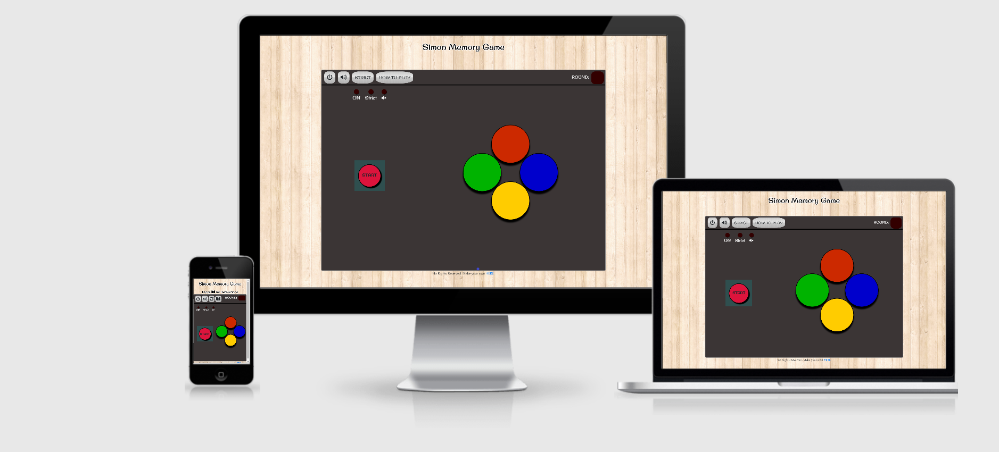
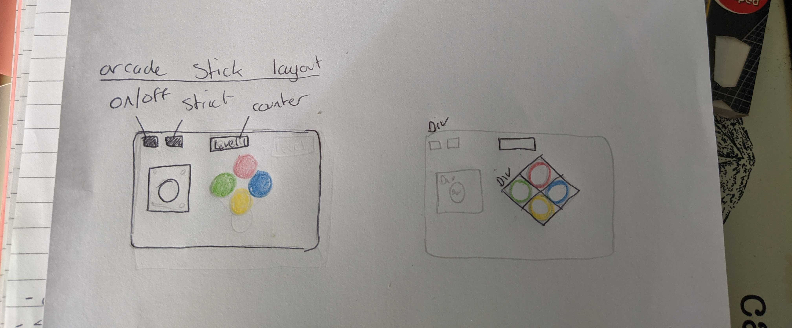
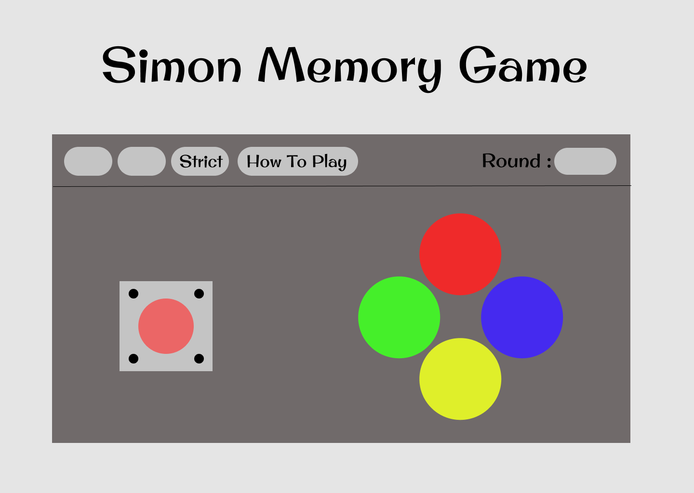

# Simon Memory Game #
## Interactive Front-End Milestone Project - Code Institue ##

A memory game based on the popular Simon game, made with HTML, CSS and JS and with
the aesthetic of an arcade stick.This game is build to be played in landscape mode on devices. I
have been experimenting with a way to only load the website in landscape but have not implimented
that function yet.  
The goal of this project was to show a better understanding of HTML amd CSS
and an understanding of the basics of JS.
  
[Live Website](https://james-stewart110.github.io/Milestone-Project-2/)

## UX ## 

## Users ##
* Expected users of this website include anyone with some time to challenge
their memory, possibly also other students that are learning to code.

## User Stories ##
### Developer ###
* I am the creator of this project and want to see it work well. I wanted to create
an interesting design that was still easy to understand and fun to play.
* As i was manually testing the flashing buttons, i was very happy to have a mute button.
### New User ###
* A new user of this game wanted the instructions to be clear.
* I am a new user of memory games and enjoy getting to higher rounds than previous games.
### Return User ###
* I have continued to use this game to test my memory and found strict mode to be rewarding but
also infuriating.
### Laptop User ###
* I am a user that mostly uses a laptop, with this site being built mobile first, i want the
experience on laptop to be just as enjoyable.
## Design Process ##
### Strategy Plane ###
* I wanted to create a project that would be a fun project for me to work on and also show that my knowledge of HTML and CSS had increased and i
    now have a good understanding of the basics of JS.
* I decided to go with the Simon memory game as it was a game i played and enjoyed as a child, also there was a good
    amount of information available to me online for help and insperation.
* The arcade stick visual i decided on because i am a big fan of fighting games like Tekken and often use an arcade stick to play them. The
    buttons on my stick are Similar colours to the Simon lights which is what originally gave me the idea.
### Scope Plane ###   
For the game to be functional and enjoyable the key features are:
* It had to be easy to understand the rules for new players, the control buttons had to be easy to tell apart.
* The differece between the on button and the start button have to be obvious to the player.
* The game buttons flash has to be long enough to be noticeable but not too long to slow down the game.
* The site was developed to be played in landscape mode on devices a feature not yet implimented to this site
would be to only load the website in landscape mode.
### Structure Plane ###
* I added a heading on mobile to direct players to the game instructions button.
* To make sure it is easy to know what each button does a key to describe the buttons, 
their icons and detailed instructions on how to play the game appear onscreen for player to read.
### Skeleton Plane ###
* Now that i had an idea of what i wanted the game to look like i started to create some mockups.
* I first started by drawing a rough design of what i wanted the game to look like.
* I then used [Figma](http://figma.com/) to flesh out the design 
### Surface Plane ###
* Background
    * I went with a wooden tile background to make the game body stand out.
    The wood texture is supposed to simulate a tabletop. 
* Game body colour
    * #3b3535 - Darkish grey colour for game body background colour. Nice flat colour for all other details to stand out against.
* Font
    * Original Surfer font. I went with this font as its a nice playful font that's 
    rounded edges work well with the rounded edges of the game.
* Control buttons
    * The buttons have a brushed metal background, i used a diffrent background for the control buttons
    to make sure they stood out from all the other components.
* Display lights
    * On light - Light turns on when power button is pressed to give visual feedback to players that game has been turned on.
    * Strict light - Light turns on when power is on and player presses strict button to give visual feedback that strict mode is active.
    * Mute light - Light turns on when power is on and player presses mute button to give visual feedback that button has been pressed.
* Round counter
    * The round counter is more visual feed back that game had been turned on, the counter will show 'ON'.
    * The round count will tell player what round they are on.
    * If player makes a wrong guess counter will show 'NO!' to let player know of wrong guess.
* Start button 
    * The start button takes the appearence of a joystick.
    * Crimson background colour. As most joysticks i have seen are red or blue i wanted to go with one of these colours.
    I went with crimson as: 
        * It stands out against the grey background better than blue.
        * It is slightly lighter than red so black text is easier to red on it.
* Game buttons    
Bright colours for the game buttons to draw player attention to them, with
a black border and shadow to add depth.
    * Red - #cc2900
    * Green - #00b300
    * Blue - #0000cc
    * Yellow - #ffcc00
    * Button flash - #ffffff - went with white instead of lighter/darker shade of same colour
    as i thought a white flash was more eye catching.
    * Buttons will all flash simultaneously when game is turned on giving the player feedback that the game 
    is on.
## Design ##
#### Overall Design ####
* The design of this game is based on a arcade stick. I chose this design as i am a big fan of the retro style and
and i belive its an original design.
#### Colours
* Heading 
    * Black with Whitesmoke outline - Stands out well and is easy to read against wood background.
* Game Body Colour
    * #3b3535 - Darkish grey - nice flat colour for all other details to stand out against.
* Text Colour
    * Whitesmoke - slightly off-white colour, stands out well but not as sharp as white.
* Control Buttons
    * I used a [metallic background](https://simurai.com/lab/2011/08/21/brushed-metal) for the control buttons
        to give them a brushed metal look.
* Start Button
    * The start button is supposed to be the top down view of the joystick.
    * Background - Crimson - Similar colour to many real joysticks.
    * Border - 2px black - Adds a thicker outline to the button giving it some added depth.
    * Box shadow - I used box-shadow to also try to give the button some extra depth.
    * Text - START in the center of the button in contrasting black so that players know instantly
    what the button does.
* Game Buttons
    * Red - #cc2900
    * Green - #00b300
    * Blue - #0000cc
    * Yellow - #ffcc00
    * Button flash - #ffffff - went with white instead of lighter/darker shade of same colour
    as i thought white was more eye catching.
    * Border - 2px black - Adds a thicker outline to buttons giving them some added depth.
    * Box shadow - I used box-shadow to also try to give the buttons some extra depth.
#### Font
* 'Original Surfer - Imported from Google Fonts. I went with this font as its a nice playful font that's 
    rounded edges work well with the rounded edges of the game.
#### Icons  
All the icons i used are from [Font Awesome](https://fontawesome.com/)
* On Button
    * I went with a widely accepted icon for the on button as its
        easily recognisable to most people.
* Mute Button
    * I went with a widely accepted icon the mute button as its
        easily recognisable to most people.
* Strict Button
    * The strict button was a difficult one for me to find an icon for, i decided
        to use text instead of an icon for all screen sizes apart from small mobile, where there was not enough
        space for text. I went with the warning icon to warn players that this is a harder mode.
* How To Play Button
    * The HTP button is only an icon on the small screen size(width < 375px). An open book icon
        and a heading telling players what the icon means appears. On larger screen sizes 'How To Play' is displayed
        in the button, so players can tell what the button does instantly.
* Mute Display Light
    * Volume mute icon.
    * I went for a different icon for the display light than the button as i thought having the display light
        start in an off state with a sound on icon next to it, players would think the game started with mute on.
#### Background ####
* From [subtlepatterns.](https://www.toptal.com/designers/subtlepatterns)
* Wooden background, nice contrast from main body, meant to simulate a tabletop.
## Mockups ##
* [Mobile](https://www.figma.com/file/gx5vF479DgluyrWyXAh3Dt/Untitled?node-id=0%3A1)
* [Laptop](https://www.figma.com/file/1zp1vfMXCdszE00pfBrUZx/Simon-Wireframe?node-id=0%3A1)

## Features ##
### Planned Features ###
* Power button
* Mute button
* Strict button
* Start button
* Round counter
* Clickable buttons
* Flashing buttons
* Way to lock screen to landscape
* Click counter
* Responsive Design - Mobile first
* Deployed - Hosted on GitHub pages

### Implimented Features ###
* Power button
* Mute button
* Strict button
* Start button
* Round counter
* Clickable buttons
* Flashing buttons
* Responsive Design - Mobile first
* Deployed - Hosted on GitHub pages
<!--* Way to lock screen to landscape-->
<!--* Click counter-->

### Technologies Used ###

* [HTML](https://www.w3schools.com/html/)
    * HTML for core structure
* [CSS](https://www.w3schools.com/css/)
    * CSS for Styling
* [JS](https://www.w3schools.com/js/default.asp)
    * JS for programming behavior
* [Github](https://github.com/)
    * Github for hosting Repositories
* [Github pages](https://pages.github.com/)
    * Github Pages for hosting deployed website
* [Gitpod](https://www.gitpod.io/)
    * Gitpod for writing and editing code
* [Google](https://www.google.com/)
    * Google used for research
* [Chrome Dev Tools](https://www.google.co.uk/chrome/?brand=CHBD&gclid=CjwKCAjwmMX4BRAAEiwA-zM4JtckdMsWqMj45TMg2IdTSsaqZ5cnBYjWqGPGPgjICIwBtUYuaLbFrhoC4bwQAvD_BwE&gclsrc=aw.ds)
    * Google Chrome Dev tools for checking and real-time editing code
* [Google Fonts](https://fonts.google.com/)
    * Font stylings
* [Bootstrap](https://getbootstrap.com/docs/4.5/getting-started/introduction/)
    * Bootstrap for HTML and CSS framework
* [Font Awesome](https://fontawesome.com/)
    * Font Awesome for button icons
* [W3C Code Validator](https://validator.w3.org/)
    * For checking markup
* [Am I Responsive](http://ami.responsivedesign.is/)
    * Used to check responsiveness over mutiple screen sizes
* [Figma](http://figma.com/)
    * Figma for creating mockups
* [W3school](https://www.w3schools.com/)
    * w3schools for tutorials and HTML colour picker
<!--* <a src="https://en.wikipedia.org/wiki/Jasmine_(JavaScript_testing_framework)">Jasmine Testing</a>
    * Jasmine used to test JS code-->

## Testing ##
### Manual Testing ###
* This project was manually tested by me and my family using chrome dev tools at each standard screen size.
* Responsive Design - The look of the game does not change much between screen sizes, only the icons appearing
on mobile and the game buttons getting bigger for larger screens.
* Mobile
    * Responsiveness - This project was made with mobile first development in mind so was continually tested throughout development.
    * Buttons - Cannot press any buttons ( apart from how to play ) while game is off, once on all buttons work correctly.
    * Display 
        * Mobile(min-width < 375px) Icons appear correctly on the control buttons and the instructions heading appears to direct 
        players to it.
        * Mobile(min-width > 375px) The icon of the how to play button are replaced with 'How To Play' correctly and the 
        instructions heading disappears. The size of the display lights also increases.
* Tablet
    * Responsiveness - Game becomes 70% of viewport width and 80% height taking up most of the screen.
    * Buttons - Cannot press any buttons ( apart from how to play ) while game is off, once on all buttons work correctly.
    * Display - Strict button icon replaced with 'STRICT'.
* Laptop
    * Responsiveness -  Game becomes 70% of viewport width and 80% height taking up most of the screen.
    * Buttons - Cannot press any buttons ( apart from how to play ) while game is off, once on all buttons work correctly.
    * Display - START  button and the coloured play buttons increase in size to fit larger container.
* Desktop
    * Responsiveness -  Game becomes 70% of viewport width and 80% height taking up most of the screen.
    * Buttons - Cannot press any buttons ( apart from how to play ) while game is off, once on all buttons work correctly.
    * Display - START  button and the coloured play buttons increase in size to fit larger container.
### Cross Browser Testing ###
* Google Chrome
    * This project was developed using Google Chrome and Chrome dev tools.
    * Base Functionality
        * The base functionality of the game works perfectly for this browser.
    * Design
        * The design looks as intended on all sizes.
        * Icons all appear and are properly sized.
    *  Responsiveness
        * Design is fluid and fits most screen sizes nicely.
* Microsoft Edge
    * Base Functionality
        * Tested through multiple games at each standard screen size - Game works well as intended.
    * Design
        * The design looks as intended on all sizes.
        * Icons all appear and are properly sized.
        * Imported font 'Original surfer' is properly loaded.
    *  Responsiveness
        * Design is fluid and fits most screen sizes nicely.
            * Tested manually using dev tools to check each standard screen size individually.

### W3C Code Validator ###
I used [W3C Code Validator](https://validator.w3.org/) to check the markup of my project.  
This process involved:

* Selecting all of the HTML code you want to check and copying it.
* Going to https://validator.w3.org/ and clicking the "Validate by direct input" tab.
* Then pasting your code into the text box and and pressing the check button below the text box.
* Any errors in your code will then be revealed.
#### HTML ####  
I had one error when i validated my code, all i had to do to fix it was move the 'title' tag further up the page
above the 'audio' tags.
#### CSS ####
I also only had one error with my css validation, it was a parse error. I had missed
a closing bracket on the mobile-medium media query
## Deployment ##
The live site is deployed on [GitHub pages](https://james-stewart110.github.io/Milestone-Project-2/).</a>

The process involved:

* Host a git repository on GitHub. [Explained here](https://kbroman.org/github_tutorial/pages/init.html). 
* The root folder contains README.md and index.html files 
* On GitHub repository settings page move to GitHub Pages section 
* Change source to master branch. (Or any desired branch) 
* Provided link will be your projects home (index) page. 

To deploy your own version of the website: 

* Have git installed 
* Visit the repository 
* Click 'Clone or download' and copy the code for http 
* Open your chosen IDE (Gitpod, VS Code, etc.) 
* Open a terminal in your root directory 
* Type 'git clone ' followed by the code taken from github repository 
  * git clone https://github.com/James-Stewart110/milestone-project-2.git 
* When this completes you have your own version of the website 
* The website can be run by opening one of the HTML files within a web browser 
* Visit the link provided 
* Your website with any made changes will appear 
* Saved changes to the website will appear here after refreshing the page 
* The benefits of hosting your website on GitHub pages is that any pushed changes to your project will automatically update the website. Development branches can be created and merged to the master when complete. 

It may take a moment for changes to appear on the hosted website. 

## Credits ##
* [Freecodecamp](https://www.freecodecamp.org/)
    * As this was my first project with JS, with the limited knowledge i have
    on the subject and also having learned to not try to re-invent the wheel, i decided
    to use code available to me online and fit it to my needs.
* [Instructions](https://www.hasbro.com/common/instruct/Simon.PDF)
    * Instructions from hasbro website
* [Background](https://www.toptal.com/designers/subtlepatterns/)
    * Background from subtlepatterns
* [Metallic background for buttons](https://simurai.com/lab/2011/08/21/brushed-metal)
### Media ###
* Audio for button sound effects from
    * [freecodecamp](https://www.freecodecamp.org/)

## Acknowledgements ##
Thanks to:
* [Owonikoko Oluwaseun](https://www.linkedin.com/in/oluwaseun-owonikoko-190318135/)
* Code Institue