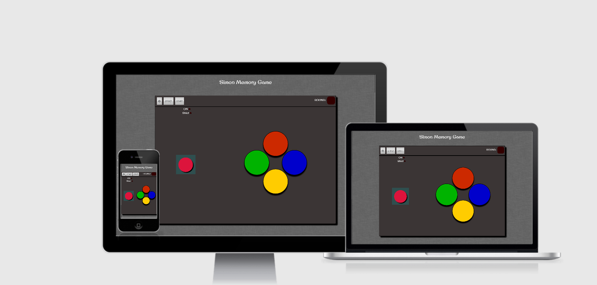

# Simon Memory Game #
### Interactive Front-End Milestone Project - Code Institue ###

A memory game based on the popular Simon game, made with HTML, CSS and JS and with
the aesthetic of an arcade stick.

### UX ### 

### Users ###
Expected users of this website include anyone with some time to challenge
their memory, possibly also other students that are learning to code.

### User Stories ###
1. The first user of this game would miss the power switch and try to start the game,
they wanted the instructions to be clearer so that the game was easier to understand.
2. 
### Design ###

### Mockups ###
*  <a src="assets/images/SimonWireframe.png">Figma mockup</a>
* <a src="https://www.figma.com/file/gx5vF479DgluyrWyXAh3Dt/Untitled?node-id=0%3A1">Figma mockup mobile</a>

### Features ###
#### Planned Features ####
* Documentation
    * README file
    * Mockup
* Way to lock screen to landscape
* Click counter
* Bootstrap - HTML and Components
* Responsive Design - Mobile first
* Jasmine testing
* Git - Version Control System
* GitHub - Remote Repository
* Gitpod - Code editor
* Deployed - Hosted on GitHub pages

#### Implimented Features ####
* Documentation
    * README file
    * Mockup
* Bootstrap - HTML and Components
* Responsive Design - Mobile first
* Git - Version Control System
* GitHub - Remote Repository
* Gitpod - Code editor
<!--* Jasmine testing-->
<!--* Way to lock screen to landscape-->
<!--* Click counter-->
<!--* Deployed - Hosted on GitHub pages-->

### Technologies Used ###

* <a src="https://www.w3schools.com/html/">HTML</a>
    * HTML for core structure
* <a src="https://www.w3schools.com/css/">CSS</a>
    * CSS for Styling
* <a src="https://www.w3schools.com/js/default.asp">JS</a> 
    * JS for programming behavior
* <a src="https://github.com/">Github</a>
    * Github for hosting Repositories
* <a src="https://pages.github.com/">Github Pages</a>
    * Github Pages for hosting deployed website
* <a src="https://www.gitpod.io/">Gitpod</a>
    * Gitpod for writing and editing code
* <a src="https://www.google.com/">Google</a>
    * Google used for research
* <a src="https://www.google.co.uk/chrome/?brand=CHBD&gclid=CjwKCAjwmMX4BRAAEiwA-zM4JtckdMsWqMj45TMg2IdTSsaqZ5cnBYjWqGPGPgjICIwBtUYuaLbFrhoC4bwQAvD_BwE&gclsrc=aw.ds">Google Chrome Dev tools</a>
    * Google Chrome Dev tools for checking and real-time editing code
* <a src="https://fonts.google.com/">Google Fonts</a>
    * Font stylings
* <a src="https://getbootstrap.com/docs/4.5/getting-started/introduction/">Bootstrap</a>
    * Bootstrap for HTML and CSS framework
* <a src="https://fontawesome.com/">Font Awesome</a>
    * Font Awesome for button icons
* <a src="http://ami.responsivedesign.is/">Am I Responsive</a>
    * Used to check responsiveness over mutiple screen sizes
* <a src="http://figma.com/">Figma.com</a>
    * Figma for creating mockups
* <a src="https://www.w3schools.com/">w3schools</a>
    * w3school.com for tutorials and HTML colour picker
<!--* <a src="https://en.wikipedia.org/wiki/Jasmine_(JavaScript_testing_framework)">Jasmine Testing</a>
    * Jasmine used to test JS code-->

### Testing ###
#### Manual Testing ####
* Chrome Dev Tool
    * This project was manually tested by me and my family using chrome dev tools at each standard screen size.
* Mobile
    * Responsiveness - This project was made with mobile first development in mind so was continually tested throughout development.
    * Buttons - Cannot press any buttons ( apart from how to play ) while game is off, once on all buttons work correctly.
    * Display 
        * Mobile(min-width < 375px) Icons appear correctly on the control buttons and the instructions heading appears to direct 
        players to it.
        * Mobile(min-width > 375px) The contents of the how to play button are replaced with 'How To Play' correctly and the 
        instructions heading disappears. The size of the display lights also increases.
* Tablet
    * Responsiveness - Game becomes 70% of viewport width and 80% height taking up most of the screen.
    * Buttons - All buttons tested mutiple times throughout several games.
    * Display - Strict button icon replaced with 'STRICT'.
* Laptop
    * Responsiveness -  Game becomes 70% of viewport width and 80% height taking up most of the screen.
    * Buttons - All buttons tested mutiple times throughout several games.
    * Display - START  button and the coloured play buttons increase in size to fit larger container
* Desktop
    * Responsiveness -  Game becomes 70% of viewport width and 80% height taking up most of the screen.
    * Buttons - All buttons tested mutiple times throughout several games.
    * Display - START  button and the coloured play buttons increase in size to fit larger container
### Deployment ###
The live site is deployed on <a href="#">GitHub pages.</a>

The process involved:

- Host a git repository on GitHub. <a src="https://kbroman.org/github_tutorial/pages/init.html">Explained here</a>. 
- The root folder contains README.md and index.html files 
- On GitHub repository settings page move to GitHub Pages section 
- Change source to master branch. (Or any desired branch) 
- Provided link will be your projects home (index) page. 

To deploy your own version of the website: 

- Have git installed 
- Visit the repository 
- Click 'Clone or download' and copy the code for http 
- Open your chosen IDE (Gitpod, VS Code, etc.) 
- Open a terminal in your root directory 
- Type 'git clone ' followed by the code taken from github repository 
  - git clone https://github.com/James-Stewart110/milestone-project-2.git 
- When this completes you have your own version of the website 
- The website can be run by opening one of the HTML files within a web browser 
- Visit the link provided 
- Your website with any made changes will appear 
- Saved changes to the website will appear here after refreshing the page 
- The benefits of hosting your website on GitHub pages is that any pushed changes to your project will automatically update the website. Development branches can be created and merged to the master when complete. 

It may take a moment for changes to appear on the hosted website. 

### Credits ###
* <a src="https://www.freecodecamp.org/">freecodecamp.org</a>
    * As this was my first project with JS, with the limited knowledge i have
    on the subject and also having learned to not try to re-invent the wheel, i decided
    to use code available to me online and fit it to my needs.
* <a src="https://www.hasbro.com/common/instruct/Simon.PDF">Instructions</a>
    * Instructions from hasbro website
* <a src="https://www.toptal.com/designers/subtlepatterns/?s=grey">Background</a>
    * Background from subtlepatterns.org
* <a src="https://simurai.com/lab/2011/08/21/brushed-metal">Metallic background for buttons</a>

### Acknowledgements ###
Thanks to:
* <a href="https://www.linkedin.com/in/oluwaseun-owonikoko-190318135/" target="_blank">Owonikoko Oluwaseun</a>
* Code Institue